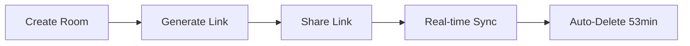

<div align="center">

# ⚡ TEXT SHARE

**Real-time text collaboration. Zero friction.**

[](https://nextjs.org)
[](https://firebase.google.com)
[](https://www.typescriptlang.org)

[View Demo](https://share-txt.netlify.app/) · [Report Bug](#) · [Request Feature](#)

</div>

---

## ⚡ Features

```
→ Real-time synchronization across devices
→ Custom URLs (like /your-room-name)
→ Auto-delete after 53 minutes
→ Shareable links - no authentication
→ Unlimited text capacity
→ Premium animations & UI
```

## 🚀 Quick Start

```bash
# Install
pnpm install

# Run
pnpm dev
```

## 🔥 Firebase Setup

```bash
1. Create project at console.firebase.google.com
2. Enable Firestore Database
3. Add security rules:
```

```javascript
rules_version = '2';
service cloud.firestore {
  match /databases/{database}/documents {
    match /rooms/{roomId} {
      allow read: true;
      allow write: if request.resource.data.text is string;
    }
  }
}
```

```bash
4. Copy credentials to .env.local
5. Restart dev server
```

## 📦 Stack

```
Next.js 16          → Framework
Firebase            → Real-time DB
Framer Motion       → Animations
TypeScript          → Type safety
TailwindCSS 4       → Styling
```

## 🎯 How It Works



## 📝 Commands

```bash
pnpm dev      # Development
pnpm build    # Production build
pnpm start    # Start production
pnpm lint     # Code linting
```

## 🔒 Security

- ⚠️ No encryption - for non-sensitive text only
- ⚠️ Anyone with link can access
- ✅ Rooms expire automatically
- ✅ 500ms debounced writes

## 📊 Performance

```
Bundle Size:    Optimized
Dependencies:   9 essential packages
Build Time:     < 30s
First Paint:    < 1s
```

## 📄 License

MIT - Created by **[Mohammed Razin CR](https://mohammed-razin-cr.me/)**

---

<div align="center">

**Built with Next.js ⚡ Firebase**

</div>
